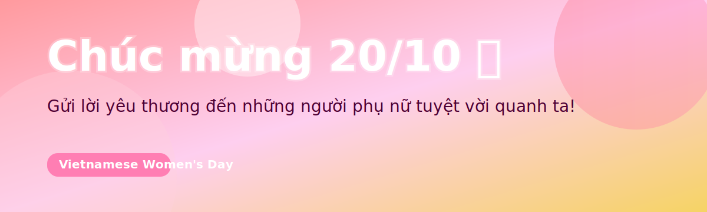

<!-- README.md -->

  

<h3 align="center">💐 Chúc mừng Ngày Phụ Nữ Việt Nam 20/10 💐</h3>

  
  

---

> Chúc một nửa thế giới luôn rực rỡ, mạnh mẽ và hạnh phúc.  
> Cảm ơn vì đã truyền cảm hứng mỗi ngày! 🌸

